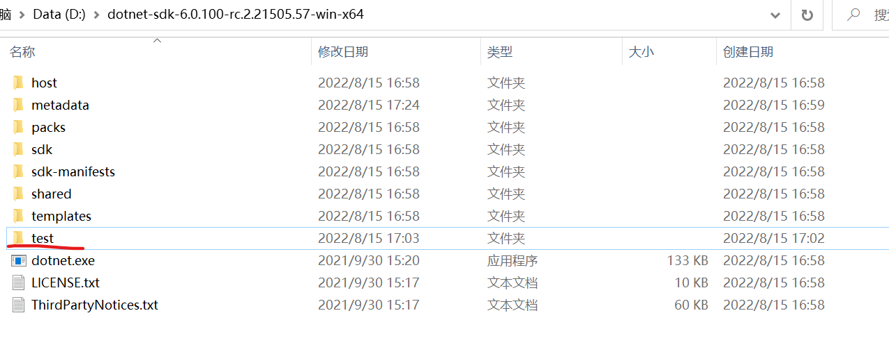
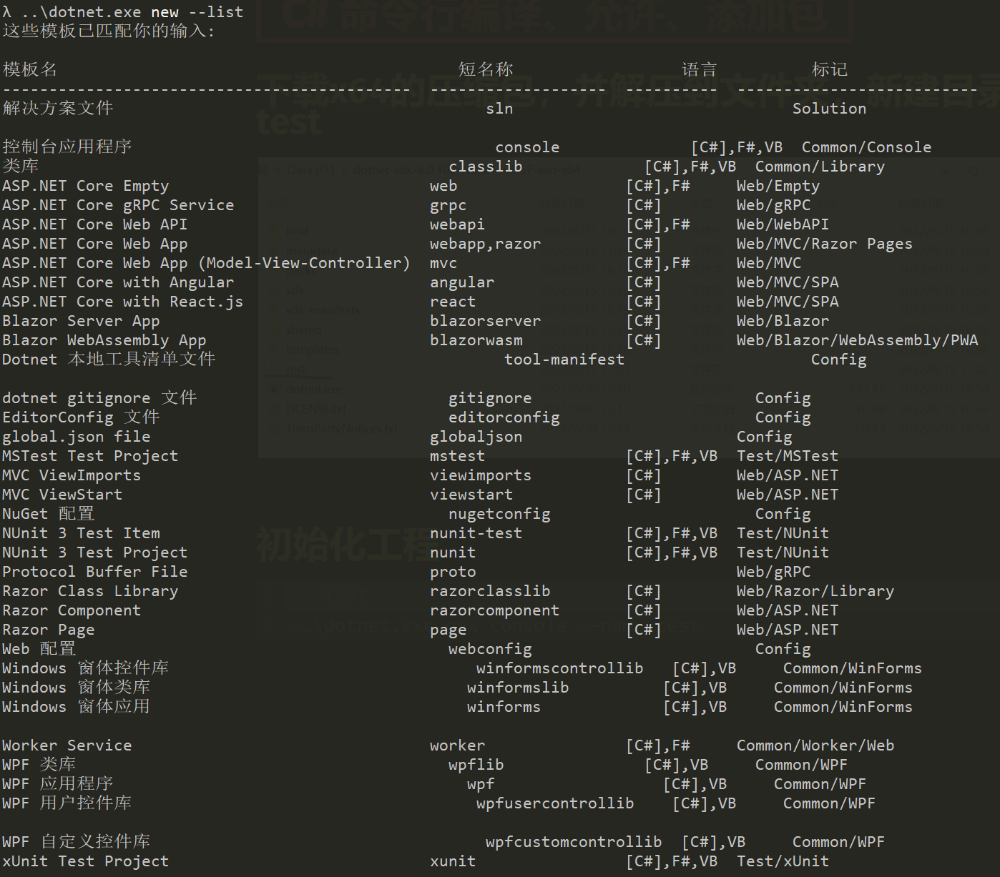
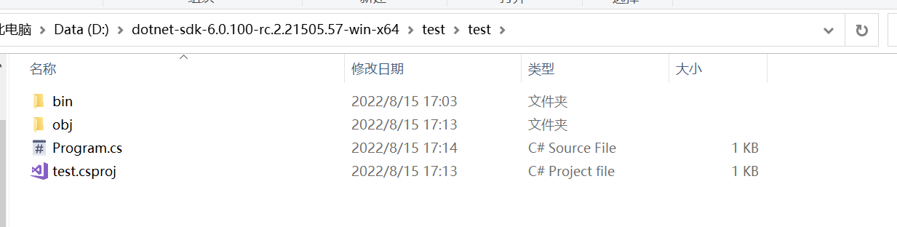
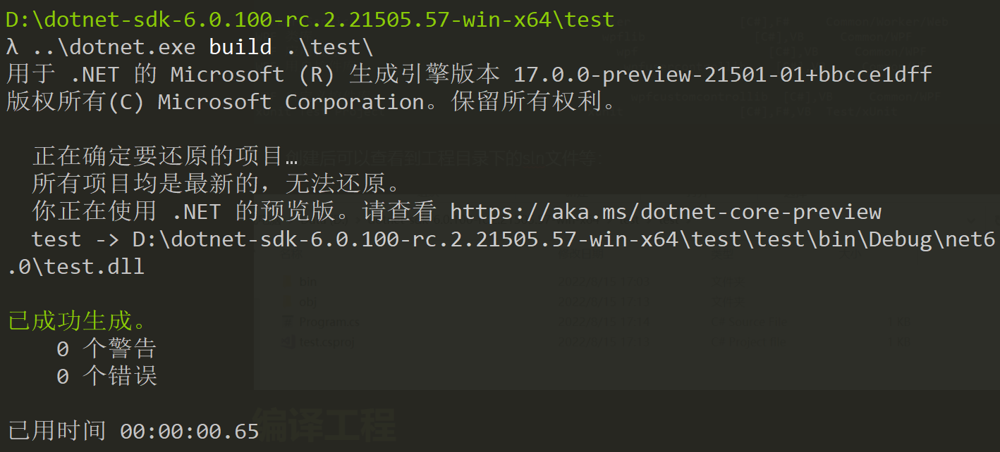
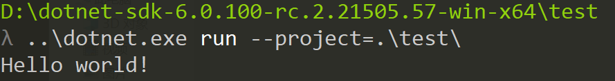
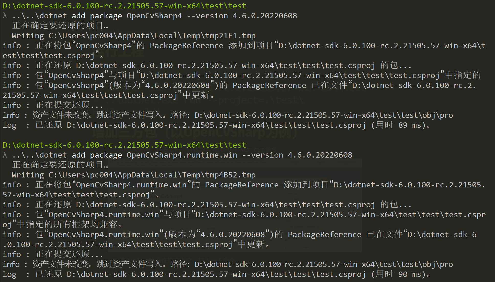

# C# 命令行编译、允许、添加包

## [下载](https://dotnet.microsoft.com/zh-cn/download/dotnet)x64的压缩包，并解压到文件夹，新建目录test




## 初始化工程

```bash
cd test
..\dotnet.exe new console --name test #在当前文件夹创建工程，名为test
```

可以使用下面命令查看可创建工程的模板

```bash
..\dotnet.exe new --list
```



创建后可以查看到工程目录下的sln文件等：



## 编译工程

```bash
..\dotnet.exe build .\test\ #在dotnet下的test路径运行
```



## 运行工程

```bash
..\dotnet.exe run --project=.\test\ # project 参数可以指定sln所在目录
```



## 增加三方包（以OpenCVSharp为例）

1. 可以从[官网](https://www.nuget.org/packages)查找安装包，并找到要添加包的`.NET CLI`命令

   

2. 进入`sln文件`所在的文件夹，输入一下命令

   ```bash
   ..\..\dotnet add package OpenCvSharp4 --version 4.6.0.20220608
   ..\..\dotnet add package OpenCvSharp4.runtime.win --version 4.6.0.20220608
   ```

   

3. 测试OpenCV，修改`program.cs`文件为

   ```c#
   //Console.WriteLine("Hello world!");
   using System;
   using OpenCvSharp; //导入OpenCV4
   
   Console.WriteLine("This is a test for OpenCVSharp");
   // 显示一张100x100全黑的图，窗口标题为"the title"
   Cv2.ImShow("the title", Mat.Zeros(100, 100, MatType.CV_8UC3));
   // 按任意键结束显示
   Cv2.WaitKey();
   ```

   
